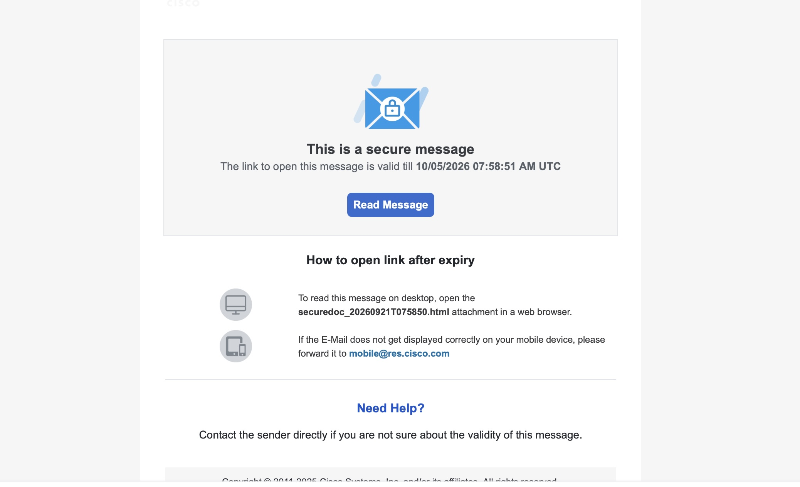
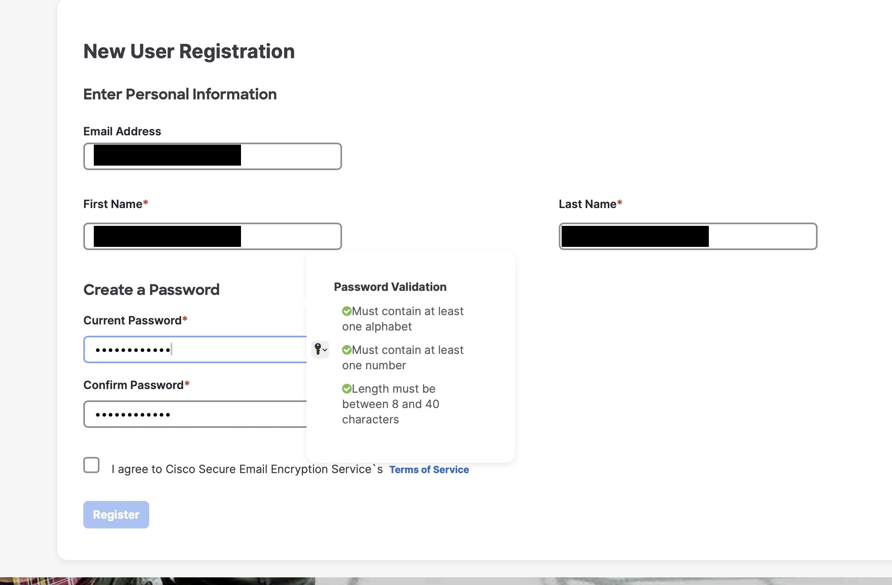
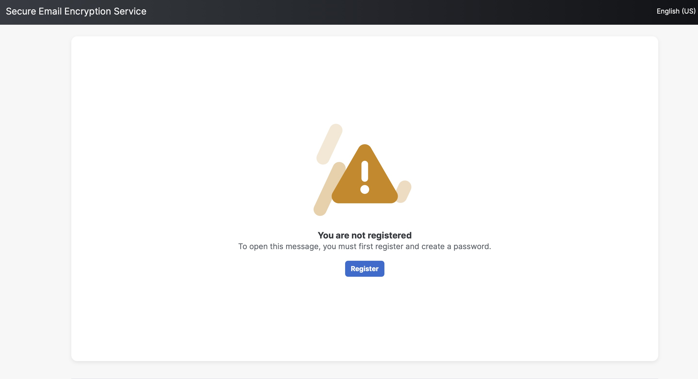
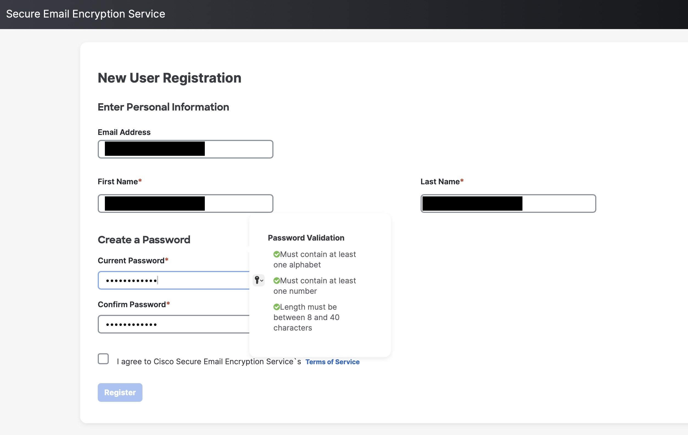
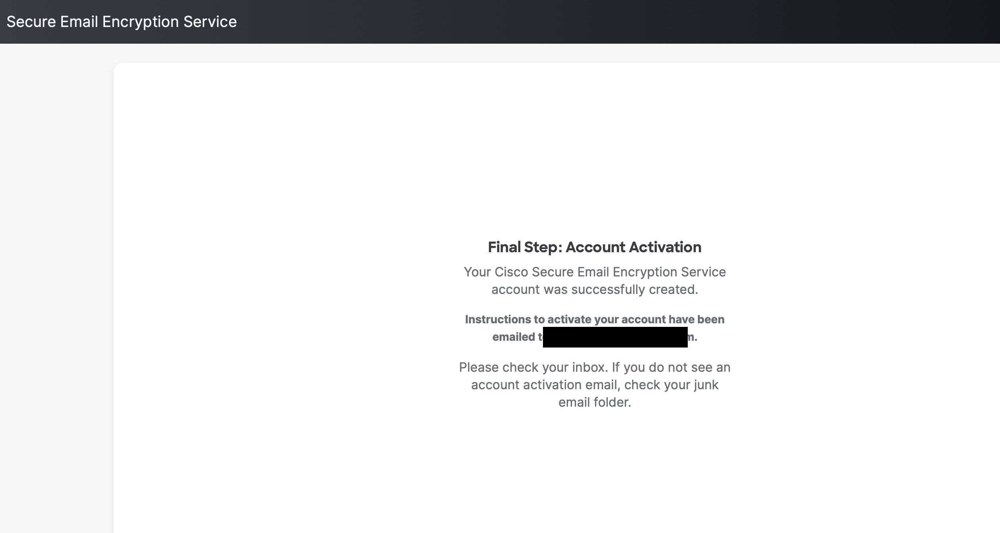
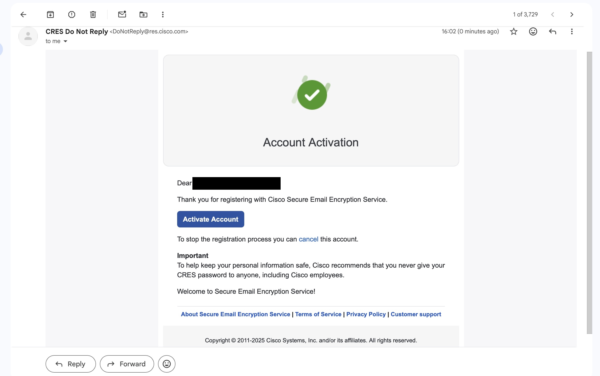
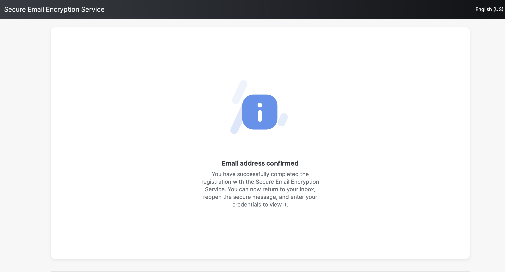
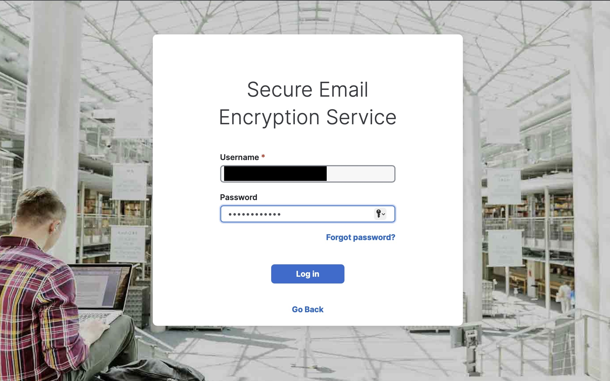
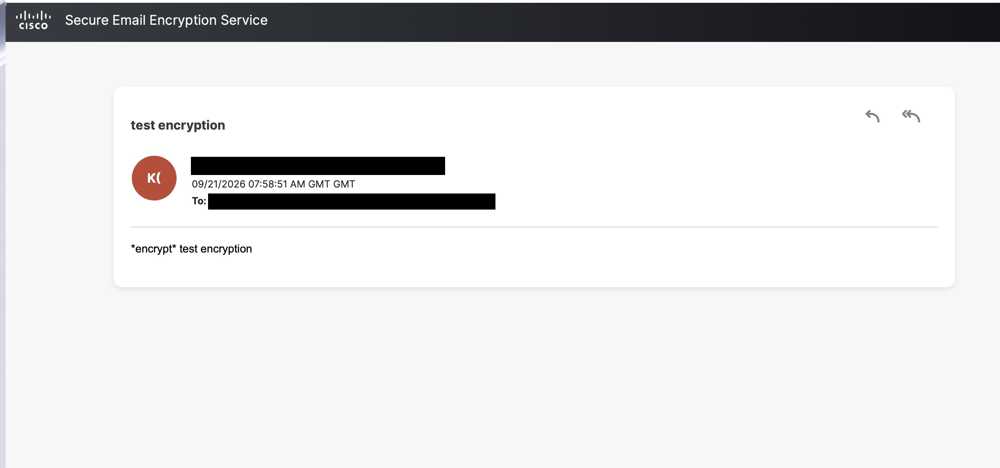

# Cisco Secure Email Encryption Service (CRES) - User Guide
## How to Read Encrypted Emails

---

## Overview

Cisco Secure Email Encryption Service (CRES) provides secure, encrypted email communication. This guide walks you through accessing and reading your encrypted emails.

---

## Step 1: Receive a Secure Email Notification

When someone sends you an encrypted email, you will receive a notification email containing:
- A **secure message indicator** with an envelope and lock icon
- The message: **"This is a secure message"**
- An **expiration date and time** for the message link
- A blue **"Read Message"** button

*Figure 1: Secure message notification email with Read Message button*

**Important:** The link to open the encrypted message is time-limited. Make sure to open it before the expiration time displayed.

### What to Do:
- Open the notification email in your inbox
- Click the **"Read Message"** button to proceed

---

## Step 2: First-Time Access - Login or Register

### If You Already Have a CRES Account:

1. Click the **"Read Message"** button
2. You will be taken to the Secure Email Encryption Service login page
3. Enter your registered email address in the **Username** field
4. Enter your password
5. Click **"Log in"**
6. You can also use **"Log in with SSO"** if your organization supports single sign-on

*Figure 2: CRES login page with username and password fields*

### If You Are New to CRES:

1. Click the **"Read Message"** button
2. You will see a login page with your recipient email address pre-filled
3. Look for **"Email address not listed"** link if you need to use a different email
4. Click **"Log in"** and you will receive an error: **"You are not registered"**

*Figure 2b: Error message when account doesn't exist yet*

5. Click the **"Register"** button to create a new account

---

## Step 3: New User Registration

If this is your first time accessing CRES, you must register:

### Enter Personal Information:

1. **Email Address** - Your recipient email address (pre-filled)
2. **First Name** - Enter your first name
3. **Last Name** - Enter your last name

### Create a Password:

The password must meet these requirements:
- ✅ Must contain at least **one alphabet character**
- ✅ Must contain at least **one number**
- ✅ Length must be between **8 and 40 characters**

*Figure 3: New user registration form with password requirements*

### Important Security Note:
Enter your password in both the **"Current Password"** and **"Confirm Password"** fields to ensure they match.

### Complete Registration:

1. Check the checkbox: **"I agree to Cisco Secure Email Encryption Service's Terms of Service"**
2. Click the **"Register"** button

---

## Step 4: Account Activation

After successful registration, you will see:

**"Final Step: Account Activation"**

A confirmation message will appear stating:
- Your Cisco Secure Email Encryption Service account was successfully created
- Instructions to activate your account have been emailed to **[YOUR_EMAIL_ADDRESS]**

*Figure 4: Account activation confirmation page*

### Next Action:

1. Check your email inbox for an **"Account Activation"** email from CRES
2. If you don't see it, check your **junk** or **spam** folder

---

## Step 5: Verify Account Activation Email

You will receive an email from **CRES Do Not Reply** `<DoNotReply@res.cisco.com>` with:

- A **green checkmark** icon and **"Account Activation"** header
- The message: **"Dear [Your Name],"**
- **"Thank you for registering with Cisco Secure Email Encryption Service."**
- A blue **"Activate Account"** button

*Figure 5: Account activation email from CRES with Activate Account button*

### Important Security Notice:
**"To help keep your personal information safe, Cisco recommends that you never give your CRES password to anyone, including Cisco employees."**

### What to Do:

1. Open the activation email
2. Click the **"Activate Account"** button

---

## Step 6: Confirm Email Address

After clicking "Activate Account," you will see:

**"Email address confirmed"**

The confirmation page states:
- You have successfully completed the registration with the Secure Email Encryption Service
- You can now **return to your inbox**
- **Reopen the secure message** and enter your credentials to view it

*Figure 6: Email address confirmation success page*

---

## Step 7: Access Your Encrypted Email

Now that your account is activated:

1. **Return to the original encrypted email notification** in your inbox
2. Click the **"Read Message"** button again
3. Enter your **username (email address)** and **password**
4. Click **"Log in"**
5. Your encrypted message will now be displayed

*Figure 7a: Successfully logged in - entering credentials*

### Your Encrypted Message

Once logged in, you'll see the complete encrypted email with:
- **Sender information** with their name and email
- **Date and time** the message was sent
- **Subject line** of the message
- **Full message content** decrypted and readable

*Figure 7b: Complete encrypted email with message content displayed*

---

## Accessing Encrypted Emails After Registration

For all future encrypted emails:

1. Click the **"Read Message"** button in the notification
2. Log in with your email address and CRES password
3. Read the encrypted message in the secure portal

---

## Troubleshooting

### Message Link Expired
**Problem:** The link in the notification email has expired

**Solution:** 
- Contact the sender directly to request a new encrypted email
- Request a new message link if the expiration time has passed

### Email Not Displaying Correctly on Mobile
**Problem:** The encrypted email doesn't display properly on your mobile device

**Solution:**
- Forward the notification email to: **`mobile@res.cisco.com`**
- An alternative format will be sent to help you access it on mobile

### Password Issues
- If you forgot your password, click **"Forgot password?"** on the login page
- Reset instructions will be sent to your registered email address

### Account Not Found
**Problem:** Error message says **"Email address not listed"**

**Solution:**
- Ensure you're using the correct email address that the sender used
- Click **"Email address not listed"** to try a different email address
- If still having issues, create a new account or contact support

### Can't Find Activation Email
**Problem:** Didn't receive the account activation email

**Solution:**
1. Check your **junk** or **spam** folder
2. Check if you entered the correct email address during registration
3. Wait a few minutes and refresh your inbox
4. Contact your IT department or CRES support

---

## Important Security Reminders

🔒 **Never share your CRES password** with anyone, including:
- Cisco employees
- IT support staff
- Other colleagues

🔒 **Secure message links are time-limited** - Always open encrypted emails before the expiration time

🔒 **Register only once** - Your account persists across encrypted email messages

---

## Need Help?

- **Contact the sender directly** if you have questions about the encrypted message
- **About Secure Email Encryption Service** - Links to Terms of Service and Privacy Policy are available in the footer of the CRES portal
- **Customer support** - Look for the "Customer support" link in the CRES interface for additional assistance

---

**Copyright © 2011-2025 Cisco Systems, Inc. and/or its affiliates. All rights reserved.**
